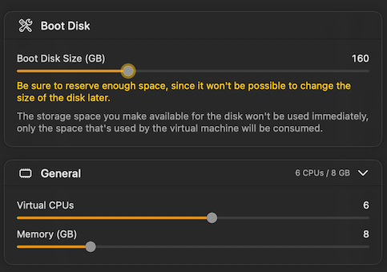
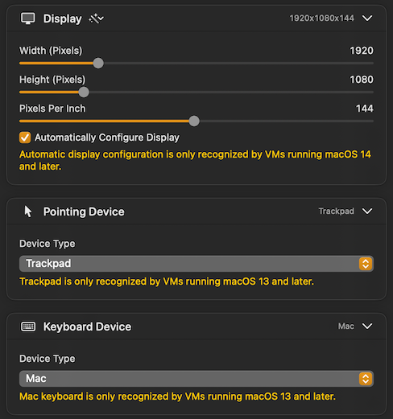
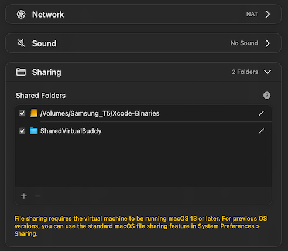
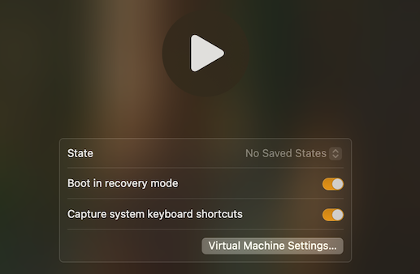

# macOS self-hosted GitHub action runner running in a local VM

I have prepared the `macos-runner-install-scripts` thanks to the official [GitHub Actions runner-image repository][gh-runner-image] and the help of ChatGPT to translate the *.anka.pkr.hcl files.  
While running the first installation step, the latest version of the [runner-images repository][gh-runner-image] is going to be downloaded automatically and will reside in the folder "~/Downloads/runner-images" for further processing.

There are various parts which need to be installed, and I tried multiple times, steadily improving the setup and the automation. As sources of inspiration served the following pages:

- [GitHub Actions documentation about self-hosted runners][gh-doc-self-hosted-runner]
- A medium article by Shokhrukh Yursunjonov: [Setup your own GitHub Actions self-hosted macOS runner on Apple M1 Mac][article-setup-macos-runner]
- Bits and pieces from the [GitHub Actions runner-image repository][gh-runner-image]
- ChatGPT condensing all the know-how and producing some bash scripts I could start with.

## Table of contents

There are multiple parts in this documentation:

1. [Setup a virtual machine (VM) running macOS](#setup-a-vm-running-macos) and configuring it to setup the initial user, disable automatic downloads of macOS updates, installing guest tools and disabling SIP
2. [Preparing the software setup and running](#preparing-and-configuring-the-installation)
3. Running the multi-step/multi-reboot installation process:
    - [Installing part 1](#installing-software-part-1)
    - [Preparing Xcode for installation](#preparing-xcode-for-installation)
    - [Installing part 2](#installing-software-part-2)
    - [Installing part 3](#installing-software-part-3)
4. [Final configurations](#final-configurations) to register the self-hosted runner.

## Setup a VM running macOS

Installing [VirtualBuddy][software-virtualbuddy] from insidegui, an open-source virtualization software which allows running macOS virtual machines on any Apple Silicon based Mac as of macOS 12.  
Follow the link to the GitHub page and check the "Releases" to find the [latest stable version](https://github.com/insidegui/VirtualBuddy/releases/latest). Download the disk image (DMG file) and move the VirtualBuddy to your Applications folder.

Creating a new virtual machine based on the desired macOS version is very simple, as VirtualBuddy is automatically loading necessary IPSW restore images from Apples server and starts the software installation. But before installing the sofware we have to configure the virtual hardware.

### Virtual hardware

- **Boot Disk Size**: use **atleast 180 GB** when you want to support two Xcode versions and still update your system (as I started once with 64 GB and quickly struggled when trying to install software)
- **General**: You can use **6 CPU cores and 8GB of memory** to mimic the GitHub runner performance characteristics. If you need more power or memory while building or testing your software, you can increase it easily later on.
- **Display**: Choose a preset from the "magic wand" drop-down, so you do not have to fiddle with the sliders. You can also activate "Automatically Configure Display" so VM will adjust automatically to the window size!
- **Pointing Device** and **Keyboard Device**, can be set to "Trackpad" and "Mac".
- **Network**: "NAT" is the right choice for home users
- **Sound**: I have it disabled, as I never intend to allow a GitHub runner make any noise 😅
- **Sharing**: To improve integration with the host macOS open the Guest drive an install the VirtualBuddyGuest helper application. Create a directory (e.g. "SharedVirtualBuddy") on your hosts disk, where you can place the scripts and Xcode files needed for the setup. To configure this shared drive, shut down the VM and check the Shared Folders section of the "Virtual Machine Settings", as highlighted below.





After setting up the hardware, pressing the "Continue" button will begin downloading necessary IPSW file and start the macOS installation process.  
In general I haven't faced any problems here. You simply need patience.

### Configuring the VM

After successfull installation, I'm welcomed with a friendly "Hello" inviting me to create the first macOS administration user. We start creating a "GitHub Runner" user (short runner) with administrator privileges.
After the initial setup wizard (avoiding to activate unnecessary features like iCloud or analytics), I'm straight going to **disable downloading of automatic system updates** in the **System Settings  app**, as I definitely do not want to download updates to the latest version of macOS. I will just do the smaller "point release" in a controlled way.
As the software installation will need multiple restarts of the VM, you can also go to the "Users & Groups" setting and enable Automatic login of our main user.

### Disable SIP

To allow some special modifications (disabling time machine and other stuff) we want to disable System Integrity Protection (SIP). To do this, shut down the VM and **boot into recovery mode**. In the start-up menu, **choose "Options"** and after "Recovery" appears on the screen, **select "Utilities > Terminal"** from the menu bar. Then type `csrutil status` to check the current status (it should be "enabled"). Then type `csrutil disable` and confirm by typing "y" and using the administrators password.  
With the command `reboot` the system will restart again with SIP disabled.



### Enable Remote Login

To enable the installation from within your host, you should enable Remote Login from the "General > Sharing" section in the Settings app.
When doing this, you are also shown the command to use for connecting using SSH. **Take note of this command** (e.g. `ssh runner@192.168.64.13`) for later use!  
Alternatively give your machine a sensible name (like macos-15-worker), so you can connect to your machine using `ssh runner@macos-15-worker.local`!

## Preparing and configuring the installation

Back in the VM as user runner, we have to download and prepare the necessary scripts.

The installation scripts can be loaded from this repository: https://github.com/pd95/macos-runner-install-scripts
So simply click on "Code" and "Download ZIP" Button and rename the automatically extracted folder in "Downloads" to "macos-runner-install-scripts-main".

Next we have to set some basic configuration in `config.sh`. This file contains some critical variables needed so the installation can succeed. So open it in "TextEditor" now.

- Check the `vm_password` variable to correspond your GitHub runner users password.
- During the installation, the scripts from "runner-image" repository need (for a, for me, unclear reason) a GitHub API personal access token. You can create one using the description on GitHubs documentation [here](https://docs.github.com/en/authentication/keeping-your-account-and-data-secure/managing-your-personal-access-tokens#creating-a-fine-grained-personal-access-token).  

  > ⚠️ Tip: If you are suspicious why this is all needed: You can create a API access token which expires in one day and does only grant read-access to your public repositories!

  Make sure you set the `github_api_pat` variable to the token you've created!

- If you have already downloaded Xcode binaries and have them stored in a "Shared Folder" of your VM specify the storage location here. But Xcode is only installed in part 2 of the installation, so more on this topic later.

## Installing software (part 1)

So to start the installation, we have use the "Terminal" application of the host an connect to the VM using the SSH command we have noted before:

    ssh runner@<your workers IP or the machine name>

After connecting, type in the following commands to create a local snapshot of the filesystem and afterwards starting the first part of the installation (with logging enabled)

```bash
cd ~/Downloads/macos-runner-install-scripts-main/scripts
bash -l install-part1.sh | tee -a install-part1.log
```

The script `install-part1.sh` checks the repository and copies some files, then starts installing the tools: Command Line Tools, Homebrew, Rosetta using the official scripts from GitHub Action runner-images.
While running the scripts, you will be prompted multiple times to provide the password for your runner user.

```text
Installing Command Line Tools...
Searching online for the Command Line Tools
Password: ***
Installing Command Line Tools for Xcode-16.2
Software Update Tool
Finding available software
Installing Command Line Tools for Xcode
Installing Homebrew...
Press RETURN/ENTER to continue or any other key to abort:
==> Downloading and installing Homebrew...
==> Updating Homebrew...
==> Unshallowing homebrew/cask
==> Unshallowing homebrew/core

Installing Rosetta
Install of Rosetta 2 finished successfully
Password: ***
Enabling automatic GUI login for the '' user..
Automatic checking for updates is turned on
Additional NTP servers adding into /etc/ntp.conf file...
The Timezone setting to UTC...
Changing shell to bash
Changing shell for root.
Changing shell for root.
Adding Homebrew environment to bash
# github.com:22 SSH-2.0-7f7d2e999
# github.com:22 SSH-2.0-7f7d2e999
# github.com:22 SSH-2.0-7f7d2e999
# ssh.dev.azure.com:22 SSH-2.0-SSHBlackbox.10
Enabling developer mode...
Password: ***
Developer mode is now enabled.
Adding AppleWWDRCAG3.cer certificate
Saving certificate
Adding DeveloperIDG2CA.cer certificate
Saving certificate
spawn automationmodetool enable-automationmode-without-authentication
Enter the password for user 'runner': 
Setting up machine to allow Automation Mode without requiring user authentication... succeeded.
Automation mode enabled successfully
Getting terminal windows
Close terminal windows: gui/501/application.com.apple.Terminal.1152921500311913340.1152921500311913345
Boot-out failed: 125: Domain does not support specified action
This device DOES NOT REQUIRE user authentication to enable Automation Mode. =~ DOES NOT REQUIRE ]]
Password: ***
Rebooting system...
```

## Preparing Xcode for installation

While the script is doing its work, you can open up the file **~/image-generation/toolset.json**. This file contains all the software tools and versions the image would try to install. It is now our chance to adjust it and get rid of the many Xcode versions we don't use! E.e. I only install Xcode 15.4 and Xcode 16.2.  
Further I go to [xcodereleases.com](https://xcodereleases.com/?scope=release) to download the Xcode versions you want to install.

Each downloaded Xcode XIP file hast to be renamed according the following scheme:

    Xcode-`version`+`build`.xip  
So for example the downloaded `Xcode_16.2.xip` has to be renamed to `Xcode-16.2+16C5032a.xip` and `Xcode_15.4.xip` to `Xcode-15.4.0+15F31d.xip`.

Place those files into a folder accessible by your VM (e.g. the  "SharedVirtualBuddy" folder we created initially and shared with the VM before) and make sure that the `xcode_install_storage_path` variable in `config.sh` is pointing to the directory!

## Installing software (part 2)

After the reboot and downloading the Xcode versions we would like to install (**don't forget to ajdust the toolset.json as [mentioned above!](#preparing-xcode-for-installation)**), we can continue with the next script: `install-part2.sh`

Log in to the VM using VirtualBuddy using the runner user (because some scripts are not working properly if the user is not logged in!).

Then connect from your hosts "Terminal" app using SSH and run the second part of the installation:

```bash
cd ~/Downloads/macos-runner-install-scripts-main/scripts
bash -l install-part2.sh | tee -a install-part2.log
```

It installs powershell, Mono (on macOS 14 only), .Net, Python, Ruby, Git, Node and more... Finally it extracts and installs the Xcode binaries located in the directory ~/Desktop/VirtualBuddyShared/SharedVirtualBuddy/Xcode-Binaries/.

```text
Continuing post-reboot installation...
Installing PowerShell...
Installing Az module
Installing Pester
Installing PSScriptAnalyzer
Installing Mono Framework 6.12.0.188...
Installing NUnit 3.15.4...
Parsing dotnet SDK (except rc and preview versions) from .json...
Dotnet operations have been completed successfully...
Installing Python Tooling
Brew Installing Python 3
Installing pipx
Install openssl@1.1
Installing Ruby...
Install Ruby from toolset...
Updating RubyGems...
Installing RubyGems 3.6.6
Bundler 2.6.6 installed
RubyGems 3.6.6 installed
Installing Git...
Installing Git LFS
Installing Node.js 20
Installing ant...
Installing aria2...
Installing azure-cli...
Installing bazelisk...
Installing carthage...
Installing cmake...
Installing gh...
Installing gnupg...
Installing gnu-tar...
Installing kotlin...
Installing libpq...
Installing libsodium...
Installing p7zip...
Installing packer...
Installing perl...
Installing pkgconf...
Installing swiftformat...
Installing tcl-tk@8...
Installing zstd...
Installing gmp...
Installing unxip...
Installing xcbeautify...
Installing xcodes...
Installing Xcode versions...
Downloading Xcode 16.2+16C5032a
Downloading Xcode 15.4.0+15F31d
Validating Xcode integrity for '/Applications/Xcode_15.4.app'...
Validating Xcode integrity for '/Applications/Xcode_16.2.app'...
Approving Xcode license for '/Applications/Xcode_15.4.app'...
Approving Xcode license for '/Applications/Xcode_16.2.app'...
Configuring Xcode versions...
Installing Simulator Runtimes for Xcode 16.2 ...
Configuring Xcode symlinks...
Rebuilding Launch Services database ...
Setting default Xcode to 15.4
Rebooting system for final setup...
```

## Installing software (part 3)

In the final script part, we are going to install more software and tools and finally generate the software report `systeminfo.md` which describes everything installed in the VM. After some final host & system modifications (=disabling Handoff & Continuity, analytics, notification center, time machine) and clearing caches, the system is rebooted for the last time.

To continue the installation, we have to log in again to the VM using the GUI and then connect from your hosts "Terminal" app using SSH and run the third part of the installation:

```bash
cd ~/Downloads/macos-runner-install-scripts-main/scripts
bash -l install-part3.sh | tee -a install-part3.log
```

```text
Finalizing setup post-reboot...
Downloading action-versions
Downloading llvm@15...
Installing Maven...
Installing Gradle ...
Installing aws...
Installing aws sam cli...
Install aws cli session manager
Installing Rustup...
Downloading gcc@12...
Downloading gcc@13...
Downloading gcc@14...
Installing Cocoapods...
Downloading android command line tools...
Installing latest tools & platform tools...
Installing latest ndk...
Installing extra android;m2repository ...
Installing extra google;m2repository ...
Installing extra google;google_play_services ...
Installing additional tool cmake;3.31.5 ...
Enabling safari driver...
Enabling the 'Allow Remote Automation' option in Safari's Develop menu
Installing Google Chrome...
Installing Selenium
Installing bicep cli...
Describing CodeQL Bundle
Installing Python 3.11.*...
Upgrading pip...
Collecting pip
Installing collected packages: pip
Install OpenSSL certificates
Installing collected packages: certifi
Installing Python 3.12.*...
Installing Python 3.13.*...
Installing Node 18.*...
Installing Node 20.*...
Installing Node 22.*...
Installing Go 1.21.*...
Installing Go 1.22.*...
Installing Go 1.23.*...
Installing Go 1.24.*...
Switching to Xcode 16.2
///////////////////////////////////////////////////////////////////
// Checking for duplicates in com.apple.CoreSimulator.SimRuntime.*
///////////////////////////////////////////////////////////////////
Running tests.
success Cleared cache.
Installation complete
*** System shutdown message from runner@macOS14-VM1.local ***
System going down in 1 minute
```

## Final configurations

### Re-setting a reasonable VM name

After the process of installing software finished, the VM has been modified to some random looking name. So its good to go back to the "System Settings" app to modify under "General > About" the name of your mac to something like macos15-runner

### Enabling/registering your runner

Now that you have installed a personal macOS runner for GitHub, you can follow the [official documentation to register it](https://docs.github.com/en/actions/hosting-your-own-runners/managing-self-hosted-runners/adding-self-hosted-runners).

As the action runner software is already installed, we can directly install it:

```bash
mkdir ~/actions-runner && cd ~/actions-runner
tar xzf /opt/runner-cache/actions-runner-osx-arm64-2.323.0.tar.gz
```

Afterwards you have to configure and register it with your repository or enterprise account:

```bash
./config.sh --url https://github.com/pd95/Simple --token ABC123XYZBLABLA
./run.sh
```

Now you can test it!

```bash
./run.sh
```

If you are ready to let the runner run after every reboot of the VM, you can install it as a service and start it automatically:

```bash
./svc.sh install
./svc.sh start
```

You can check the service status anytime later using:

```bash
./svc.sh status
```

## Links

- Documentation: [GitHub Managing self-hosted runners][gh-doc-self-hosted-runner]
- Software: [GitHub Actions runner images][gh-runner-image]
- Article: [Setup your own GitHub Actions self-hosted macOS runner on Apple M1 Mac][article-setup-macos-runner] by Shokhrukh Yursunjonov
- Software: [VirtualBuddy on GitHub][software-virtualbuddy] by insidegui

[gh-doc-self-hosted-runner]: https://docs.github.com/en/actions/hosting-your-own-runners/managing-self-hosted-runners
[gh-runner-image]: https://github.com/actions/runner-images/
[article-setup-macos-runner]: https://medium.com/@shohruhs/setup-your-own-github-actions-self-hosted-macos-runner-on-apple-m1-mac-0ae367f57813
[software-virtualbuddy]: https://github.com/insidegui/VirtualBuddy
